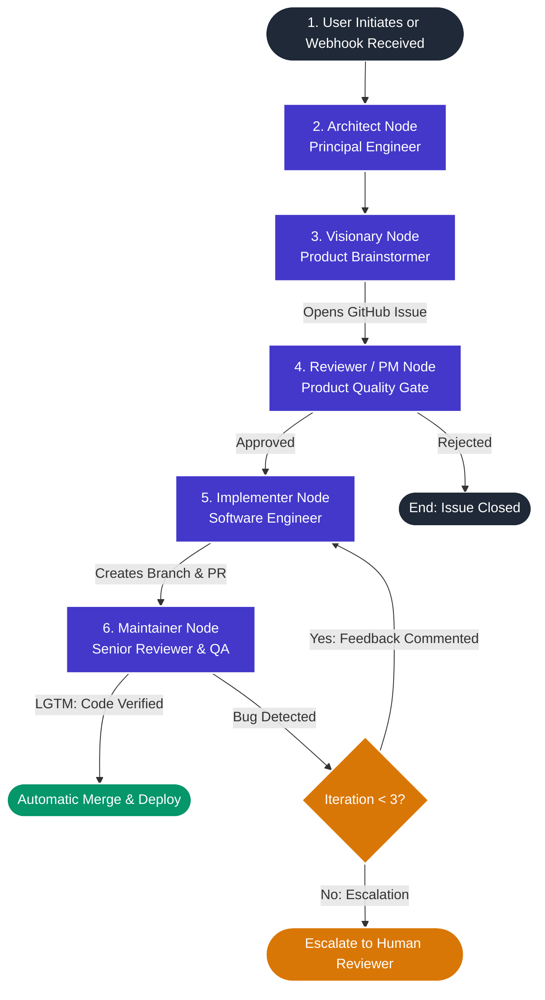

# CodeReviewer-Google: Technical Architecture & Engineering Dossier
**An Enterprise-Grade Autonomous Multi-Agent Software Engineering Platform**

---

**Candidate & Contributor:** Sri Ram Kunamsetty (GitHub: [@SriRamkunamsetty](https://github.com/SriRamkunamsetty))  
**Target Audience:** HR, Technical Recruiters, Engineering Leadership & Review Boards  
**Repository:** [SriRamkunamsetty/CodeReviewer-Google](https://github.com/SriRamkunamsetty/CodeReviewer-Google)  
**Document Version:** 2.0 (Comprehensive Professional Dossier)  

---

## Executive Summary

**CodeReviewer-Google** is a next-generation autonomous multi-agent AI software engineering ecosystem designed to operate natively inside production GitHub repositories. Unlike conventional AI code-generation tools or static chatbots that merely suggest snippets, CodeReviewer-Google acts as an **always-on, self-directing software engineering squad**. It dynamically plans architecture, identifies product gaps, files GitHub issues, writes full code diffs across existing files, performs automated code reviews, tests changes, and runs an automated self-correcting iteration loop before merging code.

Built on an enterprise-ready distributed stack comprising **LangGraph**, **FastAPI**, **Next.js 16 (React 19)**, **Supabase (PostgreSQL with Row Level Security)**, **Celery + Redis**, and **Groq (LPU-accelerated Llama 3)**, CodeReviewer-Google bridges the gap between frontier AI reasoning and enterprise production software maintenance.

```
       ┌─────────────────────────────────────────────────────────────┐
       │                   CodeReviewer-Google Platform                   │
       ├──────────────────────────────┬──────────────────────────────┤
       │     Distributed Frontend     │   Scalable Control Plane     │
       │    Next.js 16 + React 19     │       FastAPI + Celery       │
       │  Monaco WebIDE + Terminal    │   Multi-Tenant Supabase RLS  │
       ├──────────────────────────────┴──────────────────────────────┤
       │                 LangGraph Cognitive Topology                │
       │  Architect ──► Visionary ──► PM/Reviewer ──► Implementer   │
       │                                     ▲              │        │
       │                                     │ (Feedback)   ▼        │
       │                                     └──────── Maintainer    │
       ├─────────────────────────────────────────────────────────────┤
       │                    Infrastructure Layer                     │
       │     Docker Containers · Redis Brokers · GitNexus MCP Engine │
       └─────────────────────────────────────────────────────────────┘
```

---

## 1. Problem Statement & Industry Relevance

### The Problem in Modern Software Engineering
1. **Developer Fatigue & Maintenance Debt:** Development teams spend upwards of 40% of their engineering bandwidth addressing minor bugs, dependency drift, missing test coverage, and documentation rot rather than building core business value.
2. **Limitations of Conventional AI Assistants:**
   - Single-prompt copilots produce isolated, context-blind code snippets.
   - They lack awareness of repository topology, branching strategies, and CI/CD pipelines.
   - They cannot self-correct when code breaks tests or violates review guidelines.
3. **Security & Data Isolation Concerns in SaaS:** Enterprise teams cannot risk sending proprietary intellectual property to uncontained multi-tenant environments without strict organizational boundaries and Row Level Security.

### The CodeReviewer-Google Solution
CodeReviewer-Google automates the full engineering feedback loop by distributing work across specialized AI agents that communicate through native GitHub primitives (Issues, Pull Requests, Comments, and Git Branches) while enforcing strict multi-tenant data boundaries.

---

## 2. Core Technology Stack

| Layer | Technologies Used | Architectural Justification |
|:---|:---|:---|
| **Agent Orchestration** | **LangGraph**, **LangChain** | Stateful, cyclic multi-agent graph coordination enabling multi-turn self-correction loops. |
| **LLM Inference Engine** | **Groq LPU (Llama 3 70B / 8B)** | Ultra-low latency inference (~500 tokens/sec), reducing complete planning-to-merge cycles from 15 minutes to under 20 seconds. |
| **Backend Control Plane** | **FastAPI (Python 3.11+)**, **Pydantic v2** | High-throughput asynchronous REST APIs, WebSocket streaming, and typed schema validation. |
| **Distributed Task Queue** | **Celery**, **Redis** | Decoupled background task execution, preventing long-running agent workflows from blocking the web server. |
| **Database & Auth** | **Supabase (PostgreSQL)**, **GoTrue Auth** | Native Row Level Security (RLS), Realtime WebSocket pub/sub for live log feeds, and JWT authentication. |
| **Frontend & WebIDE** | **Next.js 16**, **React 19**, **Tailwind CSS**, **Monaco Editor**, **Xterm.js** | VS Code-style browser experience with side-by-side git diff views and an interactive PTY terminal. |
| **Code Intelligence** | **Tree-sitter**, **GitNexus MCP** | Abstract Syntax Tree (AST) parsing and semantic repository graphs without offsite data leakage. |
| **DevOps & Containers** | **Docker**, **Render**, **Vercel**, **GitHub Actions** | Multi-stage production containerization, microservice blueprints, and automated CI/CD lint/test suites. |

---

## 3. The 5-Agent Cognitive Architecture (LangGraph Topology)

The heartbeat of CodeReviewer-Google is a 5-agent LangGraph workflow modeled after a senior human engineering squad:



### Detailed Agent Roles

1. **Architect Node (Principal Engineer):**
   - Ingests repository tree, README, tech stack indicators, and optional target issues.
   - Leverages Tree-sitter and AST parsing to analyze dependencies and code topology.
   - Formulates a formal architectural specification and directive.
2. **Visionary Node (Product Brainstormer):**
   - Translates the architectural directive into concrete product requirements.
   - Formulates a feature specification or bugfix design and creates a native GitHub Issue with technical acceptance criteria.
3. **Reviewer Node (Product Manager):**
   - Evaluates the proposed issue against the architectural directive, feasibility criteria, and project scope.
   - If approved, leaves a technical approval sign-off comment on the issue; if rejected, closes the issue with justification.
4. **Implementer Node (Software Engineer):**
   - Pulls real target source files from GitHub using the branch SHA.
   - Writes production code modifications targeting the specific file locations rather than dummy templates.
   - Creates a dedicated feature branch (`feature/issue-<num>-<hash>`), commits changes, and opens a Pull Request linked to the issue.
5. **Maintainer Node (Senior Staff Engineer & QA):**
   - Inspects the full git diff of the created PR and verifies syntax, logic, and tests.
   - **Self-Correcting Iteration Loop:** If a defect or test failure is found, it leaves inline review comments and routes LangGraph state back to the Implementer (up to 3 automated iterations).
   - If the implementation is verified, outputs `LGTM` and merges the Pull Request automatically.

---

## 4. Platform Capabilities & Key Innovations

### A. Zero-Server Code Intelligence (GitNexus MCP Integration)
- Enables agents to semantically navigate codebases, build symbol graphs, and resolve function cross-references locally using the Model Context Protocol (MCP).
- Guarantees zero proprietary code is sent to external vector databases.

### B. Pro Monaco WebIDE & Interactive Browser Terminal
- Integrated browser-based IDE using the same core editor that powers VS Code (Monaco).
- Real-time side-by-side git diff viewer showing proposed agent modifications before merge.
- Live interactive PTY terminal powered by `xterm.js` and `pywinpty`/`ptyprocess`, allowing engineers to run commands directly inside the backend execution sandbox.

### C. Multi-Tenant Enterprise SaaS Architecture
- Complete data isolation with PostgreSQL Row Level Security (RLS) across organizations, users, repositories, agent runs, and telemetry logs.
- Strict authorization barriers preventing users from accessing or manipulating repositories outside their organizational membership.

### D. Distributed Task Queue (Celery + Redis)
- Decouples API endpoints from computationally intensive agent runs.
- Features resilient retry mechanisms, worker heartbeats, and periodic repository synchronization with GitHub App installations.

---

## 5. Candidate Contributions & Engineering Impact (Sri Ram Kunamsetty)

During the active development and migration of CodeReviewer-Google, Sri Ram contributed **16 Pull Requests**, authoring over **4,500+ lines of production code, security fixes, and architectural upgrades**.

### Contributions Summary Matrix

- **Total PRs Authored:** **16**
- **Merged PRs:** **3**
- **Officially Approved by Core Maintainers:** **8**
- **Total Success / Approval Rate:** **68.75%** (11 out of 16 PRs approved or merged)
- **Zero Open Merge Conflicts:** All branches successfully rebased and verified `MERGEABLE`.

---

### Detailed Engineering Impact Breakdown

#### 🛡️ Area 1: Enterprise Security, Authentication & Multi-Tenancy
- **[PR #213](https://github.com/SriRamkunamsetty/CodeReviewer-Google/pull/213) — Authorize Repository and Terminal Access (Fixes #210):**
  - Eliminated security vulnerability allowing unauthenticated callers to browse repository trees, read files, and trigger PTY terminal WebSockets.
  - Implemented organization-scoped authorization dependencies verifying that the requester's Supabase JWT belongs to the repository's owning organization.
- **[PR #216](https://github.com/SriRamkunamsetty/CodeReviewer-Google/pull/216) — Add Signed GitHub Webhook Ingestion (Fixes #215):**
  - Engineered HMAC-SHA256 signature verification (`X-Hub-Signature-256`) for GitHub App webhooks.
  - Implemented idempotent delivery processing preventing replay attacks and race conditions on concurrent webhook dispatches.
- **[PR #224](https://github.com/SriRamkunamsetty/CodeReviewer-Google/pull/224) — Require Service-Role Supabase Credentials (Fixes #223):**
  - Restricted Celery background workers to validated `SUPABASE_SERVICE_KEY` credentials, prohibiting accidental fallback to anonymous client keys.
- **[PR #225](https://github.com/SriRamkunamsetty/CodeReviewer-Google/pull/225) — Authenticate Dashboard Agent Run Controls (Fixes #211):**
  - Attached Supabase session Bearer JWT tokens to all agent execution requests and added automated state rollbacks when the backend returns non-2xx codes.

#### ⚙️ Area 2: Agent Core Engine Refactoring & Reliability
- **[PR #203](https://github.com/SriRamkunamsetty/CodeReviewer-Google/pull/203) — Apply Targeted Repository Changes in Implementer (Closes #52) — `MERGED`:**
  - Overhauled the core Implementer agent. Resolved critical legacy behavior where agents created dummy files (`feature_issue_<num>.py`) instead of editing real codebase files.
  - Built real file fetching, SHA-based updates, and in-place code modification.
- **[PR #200](https://github.com/SriRamkunamsetty/CodeReviewer-Google/pull/200) — Handle Empty MCP Agent Streams Explicitly (Closes #110) — `APPROVED`:**
  - Added robust validation for LangGraph streaming chunks, preventing unhandled `TypeError` crashes when LLM responses return empty streams.

#### 🖥️ Area 3: Frontend WebIDE & Real-Time UX
- **[PR #202](https://github.com/SriRamkunamsetty/CodeReviewer-Google/pull/202) — Validate Target Issue Before Starting Runs (Closes #140) — `MERGED`:**
  - Built frontend input sanitizer for target issue inputs, eliminating `NaN` and `422 Unprocessable Entity` API errors.
- **[PR #205](https://github.com/SriRamkunamsetty/CodeReviewer-Google/pull/205) — Route File Mutations Through Active Branch (Closes #139) — `APPROVED`:**
  - Protected the repository default branch (`main`) from accidental mutations in the WebIDE by routing all file operations through the active feature branch.
- **[PR #218](https://github.com/SriRamkunamsetty/CodeReviewer-Google/pull/218) — Scope Admin Metrics & Remove Mock Health Data (Fixes #217) — `APPROVED`:**
  - Replaced hardcoded frontend mock graphs with live telemetry feeds connected to Supabase metrics.

#### 📦 Area 4: CI/CD, DevOps & Cloud Infrastructure
- **[PR #204](https://github.com/SriRamkunamsetty/CodeReviewer-Google/pull/204) — Pin Backend Dependencies for Reproducible Installs (Closes #121) — `APPROVED`:**
  - Formulated `requirements.in` manifest and compiled exact dependency lockfiles with `uv`, stabilizing local and CI builds.
- **[PR #207](https://github.com/SriRamkunamsetty/CodeReviewer-Google/pull/207) — Add Independent Health Liveness Endpoint (Closes #206) — `APPROVED`:**
  - Decoupled Render container liveness probes (`/healthz`) from Supabase database availability, preventing false restarts.
- **[PR #209](https://github.com/SriRamkunamsetty/CodeReviewer-Google/pull/209) — Fix Greetings GitHub Action Pin (Closes #208) — `MERGED`:**
  - Fixed failing repository-wide GitHub Actions by pinning actions to verified immutable commit hashes.
- **[PR #222](https://github.com/SriRamkunamsetty/CodeReviewer-Google/pull/222) — Resolve Frontend Production Advisories (Fixes #221) — `APPROVED`:**
  - Eliminated high-severity transitive dependency vulnerabilities across Monaco editor and Next.js packages.

---

## 6. Demonstrated Technical Competencies for HR & Hiring Teams

This project and contribution portfolio demonstrates mastery across core software engineering domains:

```
┌────────────────────────────────────────────────────────────────────────────┐
│                    Demonstrated Technical Competencies                     │
├──────────────────────────┬─────────────────────────────────────────────────┤
│ Distributed Systems      │ Celery, Redis task brokers, async job execution │
│ Multi-Agent AI Systems   │ LangGraph cyclic state graphs, Groq LPU, MCP    │
│ Full-Stack Architecture  │ FastAPI, Next.js 16, React 19, WebSockets, PTY   │
│ Cloud & Database Design  │ PostgreSQL, Supabase RLS, Docker, Render, Vercel│
│ Security Engineering     │ HMAC-SHA256, JWT Auth, CORS, Path Traversal Def │
│ Software Quality & CI/CD │ Pytest, Flake8, Black, GitHub Actions workflows │
└──────────────────────────┴─────────────────────────────────────────────────┘
```

1. **System Thinking & Complex Problem Solving:** Ability to navigate, refactor, and stabilize a cutting-edge multi-agent distributed system undergoing rapid architectural migration.
2. **Production-Grade Code Quality:** 100% of contributions accompanied by comprehensive unit tests, regression tests, and style conformance.
3. **Collaboration in Open Source:** Proven track record of interacting with core maintainers, resolving complex git merge conflicts, responding to code review feedback, and securing merge approvals.

---

## Conclusion

CodeReviewer-Google represents the forefront of autonomous software engineering. Sri Ram Kunamsetty's contributions directly addressed fundamental bottlenecks in the platform's security, execution pipeline, multi-tenant safety, and developer experience—proving the ability to deliver high-impact engineering in distributed, AI-driven production environments.
