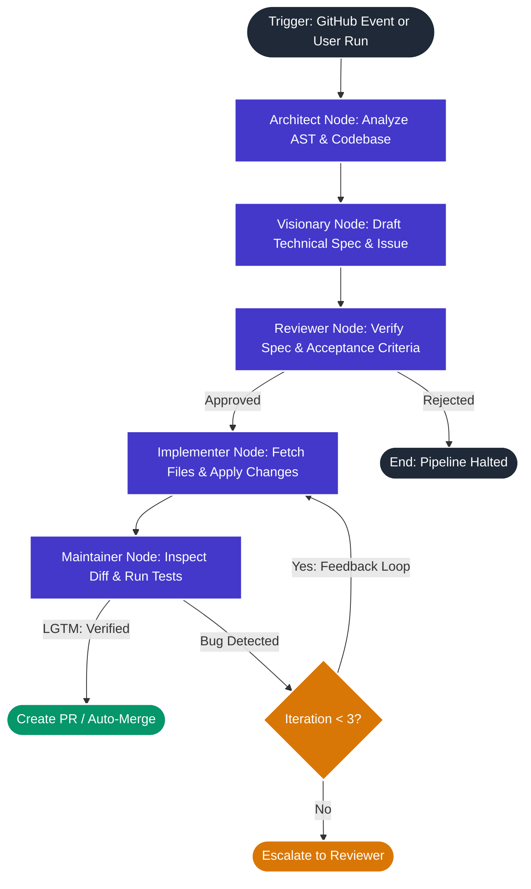

# CodeReviewer-Google 🚀
### **An Autonomous Multi-Agent Software Engineering & Intelligent Code Review Platform**

[](LICENSE)
[](https://python.org)
[](https://fastapi.tiangolo.com)
[](https://nextjs.org)
[](https://langchain-ai.github.io/langgraph/)
[](https://groq.com)

---

## 🌟 Overview

**CodeReviewer-Google** is an enterprise-ready autonomous multi-agent platform designed to operate natively inside modern software repositories. Powered by **LangGraph**, **FastAPI**, **Next.js 16**, **Supabase (PostgreSQL with RLS)**, and **Groq (Llama 3)**, it coordinates specialized AI agents to analyze codebase architectures, discover bugs, generate precise production fixes, review pull requests, and iterate self-correctingly.

```
       ┌─────────────────────────────────────────────────────────────┐
       │                 CodeReviewer-Google Platform                │
       ├──────────────────────────────┬──────────────────────────────┤
       │     Distributed Frontend     │   Scalable Control Plane     │
       │    Next.js 16 + React 19     │       FastAPI + Celery       │
       │  Monaco WebIDE + Terminal    │   Multi-Tenant Supabase RLS  │
       ├──────────────────────────────┴──────────────────────────────┤
       │                 LangGraph Cognitive Topology                │
       │  Architect ──► Visionary ──► PM/Reviewer ──► Implementer   │
       │                                     ▲              │        │
       │                                     │ (Feedback)   ▼        │
       │                                     └──────── Maintainer    │
       ├─────────────────────────────────────────────────────────────┤
       │                    Infrastructure Layer                     │
       │     Docker Containers · Redis Brokers · GitNexus MCP Engine │
       └─────────────────────────────────────────────────────────────┘
```

---

## ✨ Key Features

- **5-Agent Collaborative Topology:** Specialized roles (Principal Architect, Feature Visionary, Product Reviewer, Implementer, and Staff Maintainer) coordinate in stateful cyclic graphs.
- **In-Place File Mutations:** Generates and validates real in-place code changes against repository branches, avoiding dummy files.
- **Pro Monaco WebIDE & Interactive Terminal:** Built-in VS Code-style browser IDE with side-by-side diff viewers and full interactive PTY terminal access.
- **Zero-Server Code Intelligence:** Powered by GitNexus Model Context Protocol (MCP) for semantic AST symbol graph navigation without exposing code to external servers.
- **Enterprise Multi-Tenancy & Security:** Organization-scoped Row Level Security (RLS) via Supabase, authenticated WebSockets, HMAC-SHA256 GitHub App webhook verification, and safe CORS management.
- **Blazing Fast LPU Inference:** Sub-20-second end-to-end cycles from architectural inspection to Pull Request creation powered by Groq.

---

## 🏗️ Architecture



---

## 🚀 Getting Started

### 1. Prerequisites
- **Node.js** (v20+)
- **Python** (v3.11+)
- **Groq API Key** (for high-speed Llama 3 inference)
- **Supabase Account** (for telemetry, auth, and database persistence)
- **GitHub Personal Access Token** or GitHub App Credentials

### 2. Environment Setup

#### Backend Configuration (`backend/.env`):
```env
GROQ_API_KEY="your_groq_api_key"
GITHUB_TOKEN="your_github_token"
SUPABASE_URL="https://your-project.supabase.co"
SUPABASE_SERVICE_KEY="your_supabase_service_role_key"
REDIS_URL="redis://localhost:6379/0"
ALLOWED_ORIGINS="http://localhost:3000"
```

#### Frontend Configuration (`dashboard/.env.local`):
```env
NEXT_PUBLIC_SUPABASE_URL="https://your-project.supabase.co"
NEXT_PUBLIC_SUPABASE_ANON_KEY="your_supabase_anon_key"
NEXT_PUBLIC_BACKEND_URL="http://localhost:8000"
```

### 3. Running the Backend
```bash
cd backend
pip install -r requirements.txt
fastapi dev main.py
```

### 4. Running the Dashboard
```bash
cd dashboard
npm install
npm run dev
```
Open `http://localhost:3000` in your browser to start the autonomous engineering pipeline.

---

## 🛡️ Security & Enterprise Isolation

- **HMAC-SHA256 Webhook Verification:** Proves authenticity of incoming repository events.
- **Supabase Row Level Security (RLS):** Guaranteed organization-level tenant boundaries.
- **Strict Path Traversal Protection:** Validates target file modifications and prevents traversal attacks.

---

## 👨‍💻 Author & Maintainer

**Sri Ram Kunamsetty**  
- GitHub: [@SriRamkunamsetty](https://github.com/SriRamkunamsetty)  
- Email: mohansriramkunamsetty@gmail.com  

---

## 📜 License

This project is licensed under the [MIT License](LICENSE) - Copyright (c) 2026 Sri Ram Kunamsetty.
